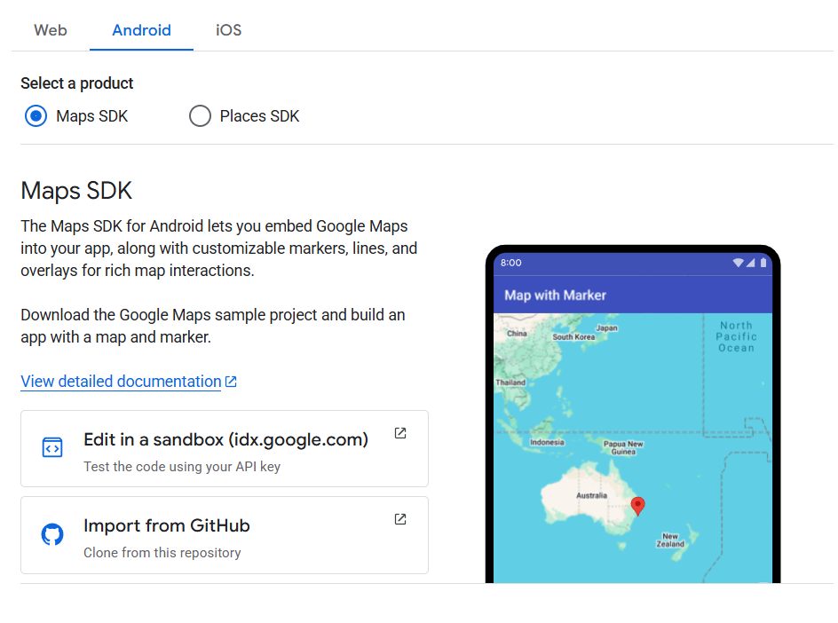
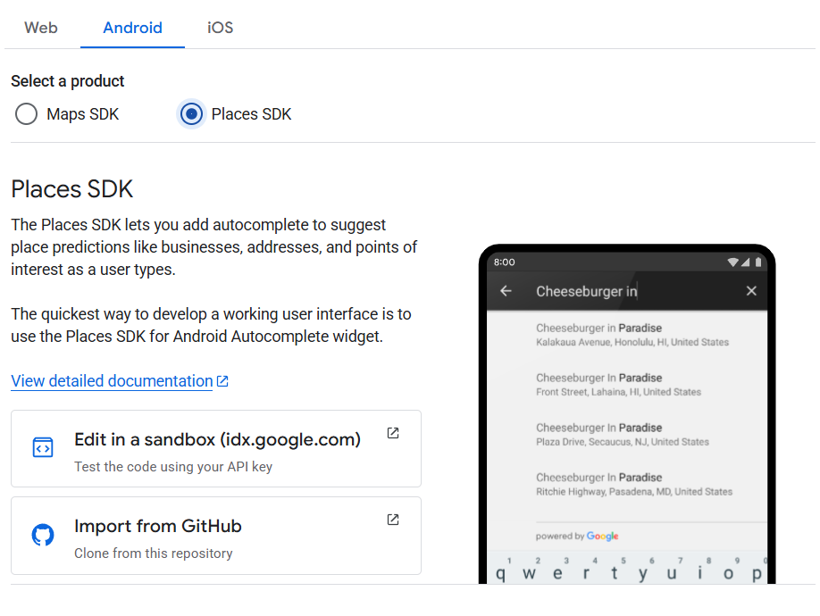
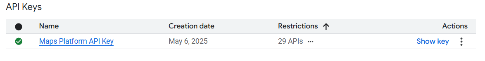
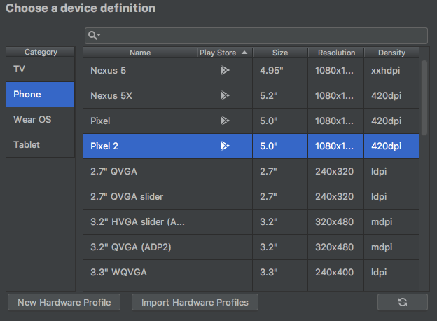

# References:
## 1. https://developers.google.com/maps/documentation/android-sdk/start
## 2. https://developers.google.com/maps/documentation/android-sdk/utility/setup

   ```implementation("com.google.maps.android:android-maps-utils:3.10.0")```

## 3. Get API KEY
   https://developers.google.com/maps/documentation/android-sdk/get-api-key

****************************IMPORTANT IMPORTANT**************************************

NOTE: Make sure, you delete the API key after you use it. DON't share to the github repo.

********************************************************************************************

## 4. Click on Go to the Credentials page from above link in Creating API Keys section.


## 5. From there, go to Keys & Credentials and Create or Select the project.


## 6. Project your API key -> Select Android Apps ( Select Maybe Later for now)

Maps SDK:
The Maps SDK for Android lets you embed Google Maps into your app, along with customizable markers, lines, and overlays for rich map interactions.


Paces SDK: https://developers.google.com/maps/documentation/places/android-sdk/autocomplete
https://developers.google.com/maps/documentation/places/android-sdk/config

    implementation("com.google.android.libraries.places:places:3.5.0")


The Places SDK lets you add autocomplete to suggest place predictions like businesses, addresses, and points of interest as a user types.
The quickest way to develop a working user interface is to use the Places SDK for Android Autocomplete widget.


7. You should have your API key as shown below:


# Troubleshooting
1. Make sure Android Emulator that you created was with the Play icon, displayed under the Play Store column. 


# Useful:
## Working with AppBar
https://developer.android.com/guide/fragments/appbar